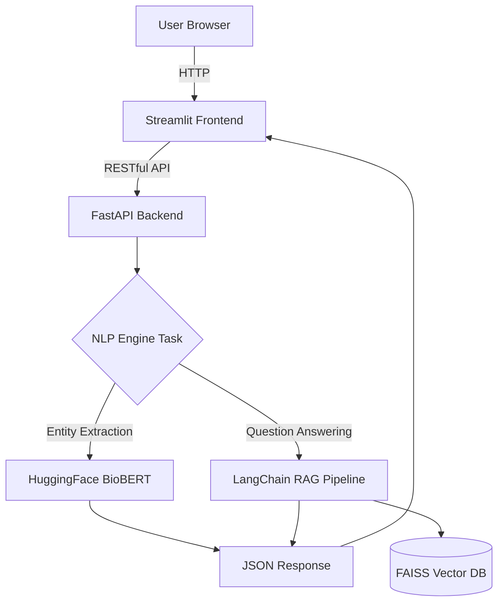

# MedNLP-RAG Core (Healthcare NLP System)

[](https://python.org)
[](https://fastapi.tiangolo.com)
[](https://github.com/hwchase17/langchain)
[](https://streamlit.io/)
[](https://huggingface.co/dmis-lab/biobert-v1.1)

A production-ready robust Natural Language Processing API designed specifically for the healthcare and clinical domain. It leverages **BioBERT / ClinicalBERT** to accurately extract medical entities from unstructured clinical notes, alongside a state-of-the-art **Retrieval-Augmented Generation (RAG)** engine (backed by LangChain and FAISS) for querying vast patient documentation.

## Features

- **Clinical Named Entity Recognition (NER)**: Robustly extracts conditions, treatments, medications, and symptoms from complex unstructured text.
- **Context-Aware Semantic Search**: Efficient querying of clinical notes using LangChain, Vector Databases (FAISS), and specialized healthcare embeddings.
- **Interactive Web Interface**: A beautifully crafted decoupled Streamlit frontend for non-technical users to utilize the NLP model seamlessly.
- **Asynchronous FastAPI Layer**: Scalable, non-blocking APIs built with FastAPI designed for concurrent medical inferences.
- **Dockerized Environment**: Fully reproducible environment configuration for on-prem or cloud delivery (HIPAA-compliant architectural mindset).

---

## 🏗 System Architecture



## 🚀 Quickstart

### 1. Running via Docker 🐳 (Recommended)

To spin up the entire stack including the FastAPI Backend and the Streamlit Frontend:

```bash
docker-compose up --build
```
- **Streamlit Frontend:** `http://localhost:8501`
- **FastAPI Backend (Swagger Docs):** `http://localhost:8000/docs`

### 2. Environment Setup (Local without Docker)

Ensure `Python >= 3.9` is installed.

```bash
python -m venv venv
# On Windows: venv\Scripts\activate
# On Unix: source venv/bin/activate
pip install -r requirements.txt
```

#### Run the Backend
```bash
uvicorn src.main:app --host 0.0.0.0 --port 8000 --reload
```

#### Run the Frontend (In a separate terminal)
```bash
# Don't forget to activate the venv again!
streamlit run frontend/app.py
```

---

## 🛠 API Endpoints Overview

- `POST /api/v1/analyze`: Upload clinical text; returns extracted medical entities.
- `POST /api/v1/query`: Ask medical questions against the ingested vectorized knowledge base (RAG).
- `GET /health`: Model and API liveness check.

## 🗂 Project Structure
- `src/`: Core FastAPI layer and ML pipeline loaders (LangChain, HuggingFace inference).
- `data/`: Contains clinical patient notes/charts (`.txt` files) automatically ingested upon boot.
- `frontend/`: Streamlit container application for interactive visual testing.

## 👨‍💻 Developed By
An AI Engineer with 5+ years of experience blending scalable backend systems and State-of-the-Art NLP.
